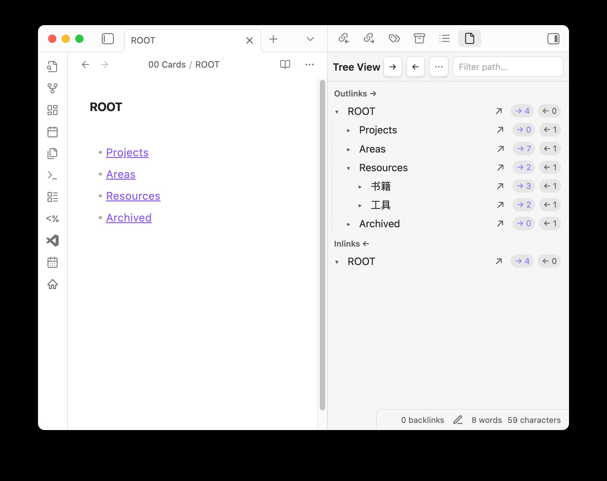

# Tree View（链接树 / Links & Backlinks Outliner）

在面板中以类似 WorkFlowy/Dynalist 的层级树展示当前笔记的正向链接（Outlinks）与反向链接（Inlinks）。支持递归展开、环路过滤、路径过滤，以及内容预览与编辑。

Displays the current note’s outlinks and backlinks in two recursive trees, similar to outliners like WorkFlowy/Dynalist. Supports expand/collapse, circular reference filtering, pathname filtering, and inline content preview/editing.

## 功能 Features
- 两棵独立的树：Outlinks → 与 Inlinks ←
- 展开/收起：单击行或左侧箭头
- 打开文件：点击行尾图标 ↗
- 顶部工具栏：`→`/`←` 显示开关、`⋯` 内容模式、搜索框路径过滤
- 内容模式：无文本 / 单行文本（回车或失焦保存）/ 全文（失焦保存）
- 徽标计数：每行显示该笔记的 `→ N` 与 `← M`
- 环路过滤：避免循环导致无限递归

- Two separate trees: Outlinks → and Inlinks ←
- Expand/collapse: click the row or left arrow
- Open note: click the trailing ↗ icon
- Toolbar: toggles for `→`/`←`, `⋯` content modes, search input for pathname filtering
- Content modes: None / Single line (save on Enter/blur) / Full text (save on blur)
- Link badges: show per-note counts `→ N` and `← M`
- Circular filtering: prevents infinite recursion

## 使用 Usage
- 启用后右侧自动打开 `Tree View` 面板。
- 打开任意笔记，面板显示该笔记的 Outlinks 与 Inlinks 两棵树。
- 单击行展开/收起；点击 ↗ 打开；箭头按钮控制显示；搜索框按路径过滤。
- `⋯` 菜单可选择内容显示模式；单行/全文可直接编辑并保存。

- After enabling, the `Tree View` panel opens on the right.
- Open any note to see its Outlinks and Inlinks trees.
- Click row to expand/collapse; click ↗ to open; use arrow toggles and search to filter.
- Use `⋯` to choose content mode; edit and save inline.
